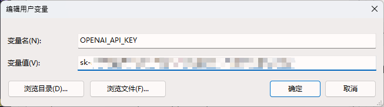

# chat-mind-map

---

_Under development_

---

## How to run

### 1. Clone the repository

```bash
git clone git@github.com:OpenAtom-SEU/chat-mind-map.git
```

### 2. Prepare the environment

Node.js + npm

### 3. Install dependencies

```bash
npm install

bower install kityminder-editor
```

### 4. Configure your OpenAI api key

Add to environment variables:

`Win` + `R` -> `sysdm.cpl` -> `Advanced/高级` -> `Environment Variables/环境变量` -> `New/新建`



:warning: **不要把你的 api key 写进代码推送到远程仓库**

### 5. Run

```bash
grunt dev
```

Or run `app.js` directly, and visit `localhost:3000`.
